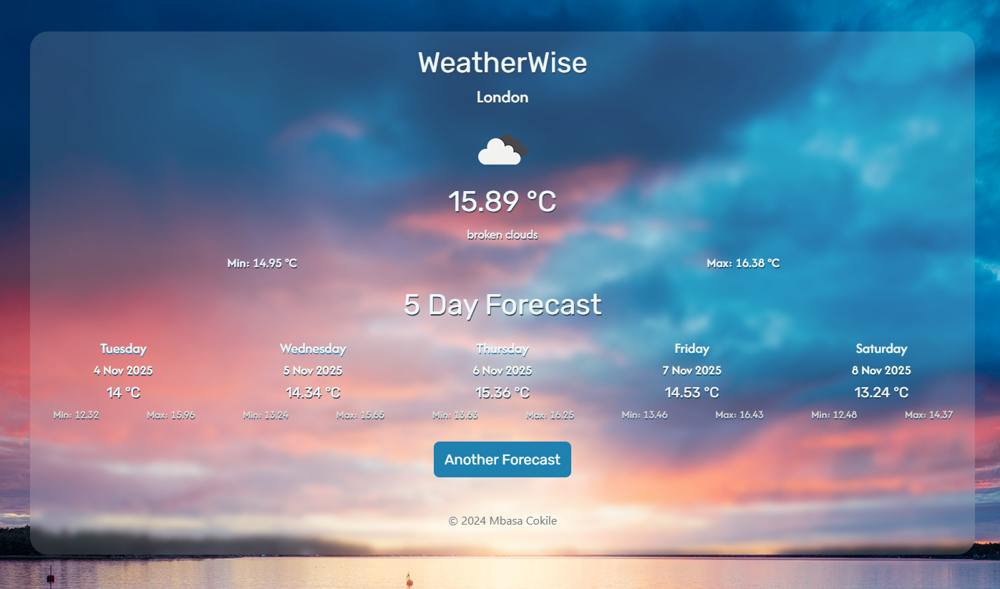

# 🌦️ WeatherWise: Modern Weather Forecast Dashboard

Your personal weather companion with elegant visuals and precise forecasts.

## Project Overview

WeatherWise is a sleek, responsive web application that transforms complex weather data into beautiful, easy-to-understand forecasts. Built with modern web technologies, it provides users with real-time weather information and detailed future forecasts in an intuitive interface.

Whether you're planning your daily commute or a weekend getaway, WeatherWise delivers accurate weather insights with dynamic visualizations and location-based updates, making weather tracking both informative and visually engaging.

## 🚀 Features

- 🎯 **Real-time Weather Data** - Get instant access to current weather conditions for any location
- 🗺️ **Location Search** - Find weather information for any city worldwide with smart search
- 📱 **Responsive Design** - Seamless experience across desktop, tablet, and mobile devices
- 📊 **Dynamic Weather Visuals** - Beautiful, interactive weather visualizations and icons
- 🕒 **Extended Forecasts** - Detailed weather predictions for the upcoming days
- 🌡️ **Comprehensive Metrics** - Temperature, humidity, wind speed, and more in your preferred units

## 📂 Project Structure

```
Weather-App/
├── public/
│   ├── images/         # Weather icons and visual assets
│   └── styles/         # CSS stylesheets
│       └── style.css
├── views/
│   ├── error.ejs      # Error page template
│   ├── index.html     # Main landing page
│   └── results.ejs    # Weather results display
├── index.js           # Main application entry point
└── package.json       # Project dependencies and scripts
```

## ⚙️ Installation

1. Clone the repository:
```bash
git clone https://github.com/mbasacokile7/Weather-App.git
cd Weather-App
```

2. Install dependencies:
```bash
npm install
```

3. Create a `.env` file in the root directory and add your weather API key:
```bash
WEATHER_API_KEY=your_api_key_here
```

4. Start the application:
```bash
npm start
```

## 🌐 Usage

1. Open your browser and navigate to `http://localhost:3000`
2. Enter a city name or location in the search bar
3. View detailed weather information including:
   - Current temperature and conditions
   - Hourly forecast
   - 5-day weather outlook
   - Wind speed and direction
   - Humidity and precipitation chances

## 📸 Screenshots


*Main dashboard showing current weather and forecast*


*Location search with auto-complete suggestions*

## 🙌 Acknowledgments

- Weather data provided by [OpenWeather API](https://openweathermap.org/api)
- Icons from [Weather Icons](https://erikflowers.github.io/weather-icons/)
- Built with [Node.js](https://nodejs.org/), [Express](https://expressjs.com/), and [EJS](https://ejs.co/)
- Styling enhanced by [Bootstrap](https://getbootstrap.com/)

---

Made with ❤️ by Mbasa Cokile